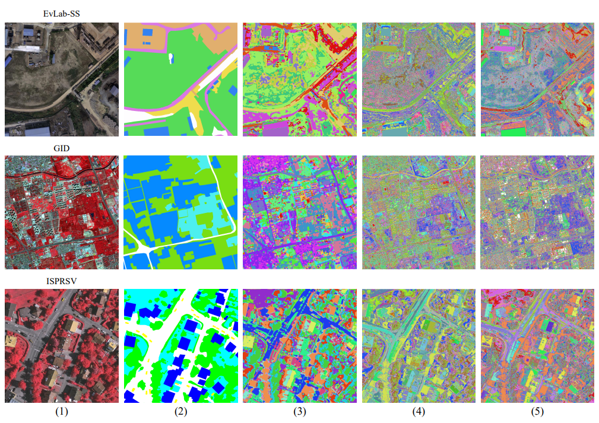

# A Superpixel-Guided Unsupervised Fast Semantic Segmentation Method of Remote Sensing Images

[English](./README-zh_CN.md) | 简体中文 

本开源项目建立在[《超像素引导的无监督遥感图像快速语义分割方法（A Superpixel-Guided Unsupervised Fast Semantic Segmentation Method of Remote Sensing Images）](https://ieeexplore.ieee.org/document/9854897?source=authoralert)》的研究基础上，可为研究人员提供实验源代码。研究成果目前已公开发表在IEEE Geoscience and Remote Sensing Letters期刊上。本项目可以多GPU并行计算，从而大大提升影像分割效率。

## 论文摘要
语义分割是像素级遥感影像分析的基本任务之一。目前，大多数高性能语义分割方法都是以监督学习的方式进行训练的。这些方法需要大量的图像标签作为支持，然而人工标注的数据集很难获得。为了解决这个问题，我们在这篇文章中提出了一种基于超像素分割和全卷积网络（FCN）的高效无监督遥感图像分割方法。我们的方法可以在没有任何人工标注标签或先验知识的情况下快速实现各种尺度的像素级影像分割。我们的方法使用了超像素分割结果作为合成地面真实值来指导 FCN 训练期间的梯度下降方向。在三个公共数据集上的实验结果表明，与当前的无监督图像分割方法相比，我们的方法具有更高的性能。具体来说，我们的方法在高分图像数据集 (GID) 的调整互信息 (AMI) 分数为0.2955，且仅用了 30 秒的时间就可以处理完大小为 7200 × 6800 像素的影像。

### 网络结构
网络结构如下图所示。


### 输出样例
EvLab-SS，GID以及ISPRSV数据集部分原始影像和不同对比方法结果图： （1）原始影像，（2）地表真实标签，（3）我们提出的方法结果，（4）ISODATA，（5）K-means



## 运行需求
### 环境
```
python=3.7.0
pytorch=1.8.1
gdal=3.4.0 
scikit-image=0.18.1
scikit-learn=0.24.2
tqdm=4.61.2
```

### 配置
将本项目下载到本地:
```
git clone https://git.chenguanzhou.com/chenguanzhou123/Unsupervised-OBIC-Pytorch.git
cd Unsupervised-OBIC-Pytorch
```
### 运行
开始无监督分割之前需要先运行segmentation.py
```
python segmentation.py 
python train_net.py -i data/GID_example/example.tif 
```
## 文件目录说明
```
filetree 
├── /data/
│  ├── /GID_example/
│  │  └── example.tif
├── /figures/
│  ├── model.png
│  └── result.png
├── /losses/
│  ├── focal_loss.py
│  └── lovasz_losses.py
├── /results/
├── evaluate_gt.py
├── inference.py
├── model.py
├── README.md
├── segmentation.py
├── to_ave_color.py
└── train_net.py

```

## 引用
如果您在研究中使用了该项目，请引用以下文章。
```
@article{chen2022superpixel,
  title={A Superpixel-guided Unsupervised Fast Semantic Segmentation Method of Remote Sensing Images},
  author={Chen, Guanzhou and He, Chanjuan and Wang, Tong and Zhu, Kun and Liao, Puyun and Zhang, Xiaodong},
  journal={IEEE Geoscience and Remote Sensing Letters},
  year={2022},
  publisher={IEEE}
}
```

## 声明
代码仅出于非商业和研究目的而发布。若为商业目的使用，请联系作者。

## 参考项目
https://github.com/Yonv1943/Unsupervised-Segmentation

Asako Kanezaki.
**Unsupervised Image Segmentation by Backpropagation.** 
*IEEE International Conference on Acoustics, Speech and Signal Processing (ICASSP)*, 2018.
([pdf](https://kanezaki.github.io/pytorch-unsupervised-segmentation/ICASSP2018_kanezaki.pdf))