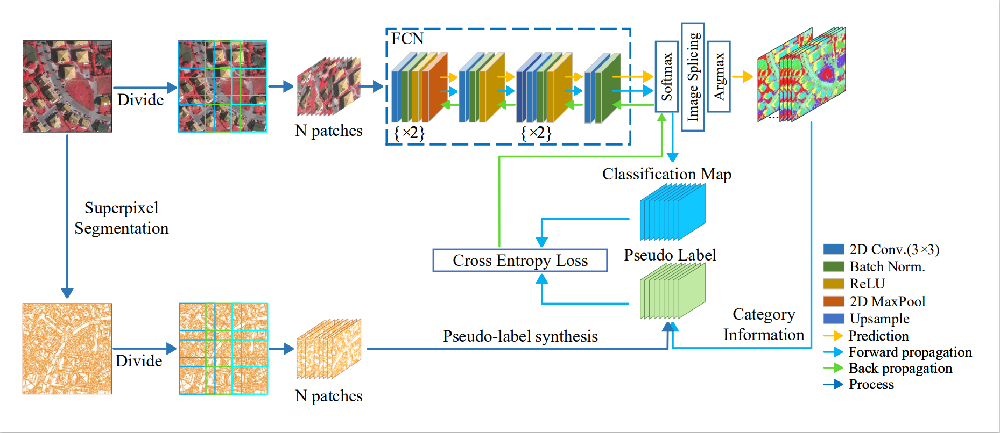

# A Superpixel-Guided Unsupervised Fast Semantic Segmentation Method of Remote Sensing Images
This repo explains the working of our Unsupervised Segemntaion Algorithm published in IEEE Geoscience and Remote Sensing Letters.

You can access the [**_full paper here_**](https://ieeexplore.ieee.org/document/9854897?source=authoralert).

## Abstract
Semantic segmentation is one of the fundamental tasks of pixel-level remote sensing image analysis. Currently, most high-performance semantic segmentation methods are trained in a supervised learning manner. These methods require a large number of image labels as support, but manual annotations are difficult to obtain. To address the problem, we propose an efficient unsupervised remote sensing image segmentation method based on superpixel segmentation and fully convolutional networks (FCNs) in this letter. Our method can achieve pixel-level images segmentation of various scales rapidly without any manual labels or prior knowledge. We use the superpixel segmentation results as synthetic ground truth to guide the gradient descent direction during FCN training. In experiments, our method achieved high performance compared with current unsupervised image segmentation methods on three public datasets. Specifically, our method achieves an adjusted mutual information (AMI) score of 0.2955 on the Gaofen Image Dataset (GID), while processing each image of size 7200 $\times$ 6800 pixels in just 30s.

### Network Architecture
Following images shows the Complete Network Architecture.



### Example Output
Original images and the segmentation results of different segmentation methods on the EvLab-SS, the GID and the ISPRSV datasets: (1) original image, (2) ground truth, (3) our proposed method, (4) ISODATA, (5)  K-means


### Citation
If you like to use our work please consider citing us;
```
@article{chen2022superpixel,
  title={A Superpixel-guided Unsupervised Fast Semantic Segmentation Method of Remote Sensing Images},
  author={Chen, Guanzhou and He, Chanjuan and Wang, Tong and Zhu, Kun and Liao, Puyun and Zhang, Xiaodong},
  journal={IEEE Geoscience and Remote Sensing Letters},
  year={2022},
  publisher={IEEE}
}
```
OR via [google scholar](https://scholar.google.com/citations?user=lZp8aC4AAAAJ&hl=zh-CN&oi=sra)


## Requement
python3, pytorch, opencv2, osgeo, scikit-image

## Getting Started
Run our segmentation code
```
python segmentation.py 
python train_net.py -i data 
```